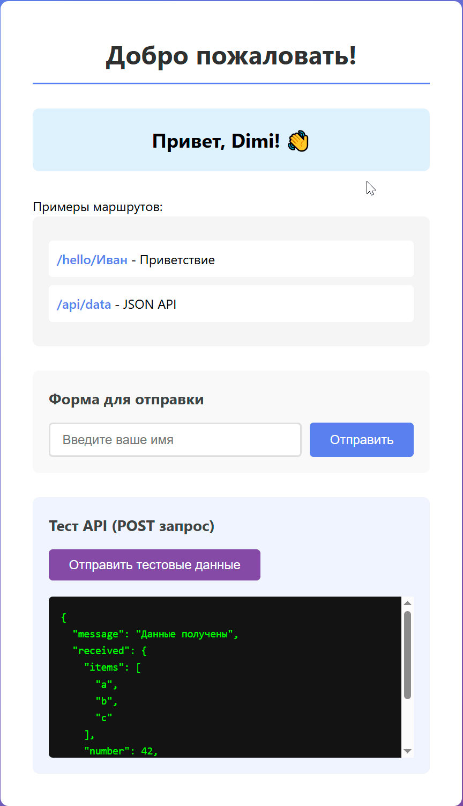

# Ansible-playbook для деплоя веб-приложения на Python на сервере с ОС Ubuntu 24.04 (Задание №2)


## 🚀 Быстрый старт

1. **Клонируйте репозиторий на Ansible-машину:**
```bash
git clone https://github.com/dimilink/prosoft-ansible.git
cd prosoft-ansible
```

2. **Укажите в файле инвентаризации `hosts.ini` ip-адрес сервера и пользователя Ansible:**
```bash
[webservers]
0.0.0.0 ansible_user=
```

3. **Запустите playbook:**
```bash
ansible-playbook -i hosts.ini playbook.yml -K
```

3. **Откройте в браузере приложение в браузере используя HTTPS:**
```bash
https://<ip-адрес_сервера>
```


